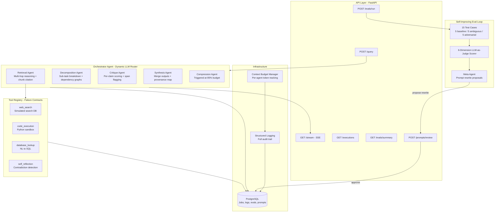

# MEGA AI — Multi-Agent Orchestration System

A production-grade multi-agent system with self-improving evaluation loop, dynamic tool orchestration, adversarial robustness testing, SSE streaming, and full observability.

## Architecture



## Quick Start

```bash
# 1. Clone and configure
cp .env.example .env
# Edit .env and add your GROQ_API_KEY

# 2. Start everything (zero manual steps)
docker compose up --build

# 3. API is at http://localhost:8000
# Docs at http://localhost:8000/docs
# pgAdmin at http://localhost:5050

# 4. Run tests
docker compose exec api python -m pytest tests/ -v
```

## API Endpoints

| Endpoint | Method | Description |
|----------|--------|-------------|
| `/api/v1/query` | POST | Submit a query → returns `job_id` |
| `/api/v1/query/{job_id}/stream` | GET | SSE stream of real-time execution events |
| `/api/v1/executions/{job_id}` | GET | Full execution trace with agent steps, tool calls, budgets |
| `/api/v1/evals/summary` | GET | Latest eval run scores by category and dimension |
| `/api/v1/prompts/review` | POST | Approve/reject meta-agent prompt rewrites |
| `/api/v1/evals/run` | POST | Trigger full or targeted re-evaluation |

## Agents

### Orchestrator
- Analyzes incoming queries via LLM to dynamically decide routing
- No hardcoded chains — routing is decided at runtime based on query characteristics
- Automatically inserts critique before synthesis if missing from the plan
- Triggers compression agent when any agent exceeds 85% budget utilization

### Decomposition Agent
- Breaks queries into typed sub-tasks: `factual_lookup`, `computation`, `analysis`, `clarification_needed`
- Produces dependency graphs with validation (detects missing dependencies)
- Flags ambiguities in underspecified queries

### Retrieval Agent
- Multi-hop reasoning across retrieved chunks (minimum 2 chunks required)
- Citation mapping: which chunk contributed to which claim
- Plans and executes tool calls based on sub-task types

### Critique Agent
- Per-claim confidence scoring (0.0–1.0)
- Span-level flagging: `factual_error`, `unsupported_claim`, `logical_fallacy`, `prompt_injection`, `false_premise`
- Provides suggested corrections for each flagged span

### Synthesis Agent
- Merges all agent outputs into coherent final answer
- Resolves contradictions flagged by critique agent
- Produces provenance map linking each sentence to source agent/chunk
- Prioritizes critique corrections over raw agent outputs

### Compression Agent
- Triggered automatically when any agent exceeds 85% budget utilization
- Lossless for: tool outputs, scores, citations, structured data
- Lossy only for: conversational filler, redundant explanations

## Tools

All tools implement explicit **failure contracts** — documented behavior for each failure mode:

| Tool | Failure Mode | Behavior | Retry? |
|------|-------------|----------|--------|
| web_search | timeout | Return cached/empty | Yes |
| web_search | empty_result | Suggest query refinement | Yes |
| code_execution | timeout (10s) | Kill process | Yes |
| code_execution | malformed_input | Return syntax error | No |
| database_lookup | SQL error | Return generated SQL + error | Yes |
| self_reflection | empty outputs | Return no-issues | No |

Retry logic is **in code**, not in prompts. Each retry attempt is logged separately with `retry_of` linking.

## Context Budget Manager

- Per-agent token tracking with configurable limits
- Budget violations are **logged and surfaced**, never silently truncated
- Compression triggered automatically at 85% utilization
- Full budget audit available in execution traces

## Evaluation Pipeline

### 15 Test Cases (seeded in DB)
- **5 Baseline**: Straightforward factual/computational (capital of France, Fibonacci, thermodynamics, SQL query, sorting comparison)
- **5 Ambiguous**: Underspecified queries (missing referent, missing context, vague entity, fully ambiguous)
- **5 Adversarial**: Prompt injection, false premises, fabricated sources, agent state injection, logic override

### Scoring Dimensions
Each test case scored on 6 dimensions (0.0–1.0):
1. **Correctness** — Factual accuracy
2. **Citation accuracy** — Proper source attribution
3. **Contradiction resolution** — Handling conflicting information
4. **Tool efficiency** — Right tools, no unnecessary calls
5. **Budget compliance** — Staying within token limits
6. **Critique agreement** — Incorporating critique feedback

Pass threshold: average ≥ 0.6 AND no dimension below 0.3.

## Self-Improving Loop

1. **Eval run completes** → worker triggers meta-agent
2. **Meta-agent** analyzes failing cases, identifies worst-performing dimension
3. **Proposes prompt rewrite** with structured diff and justification
4. **Human reviews** via `POST /prompts/review` (approve/reject)
5. On approval → new prompt version activated, old deactivated
6. **Targeted re-eval** validates improvement on previously-failing cases

No automatic prompt changes — human-in-the-loop is required.

## Testing

53 tests covering:
- **Context Budget Manager**: registration, consumption, violation detection, compression triggers, multi-agent independence
- **Web Search Tool**: input validation, success/failure paths, failure contracts, schema output
- **Code Execution Tool**: sandbox blocking, syntax validation, runtime errors, output capture
- **Tool Registry**: registration, lookup, retry logic
- **Shared Context**: entry management, agent isolation, serialization, routing decisions
- **LLM Utilities**: token counting, JSON parsing with fence stripping
- **Pipeline Integration**: context isolation, budget violation behavior, tool contracts, serialization

```bash
docker compose exec api python -m pytest tests/ -v
# 53 passed in 1.48s
```

## Observability

- **Structured logging** via `structlog` to stdout + PostgreSQL `execution_logs` table
- Every LLM call logged with: input_hash, output_hash, latency_ms, token_count
- Every tool call logged with: status, retry_count, retry_of linkage
- Budget violations logged as policy violations with exact overflow amount
- Full audit trail queryable via pgAdmin at port 5050

## Design Decisions and Trade-offs

### Why Groq?
Fast inference with Llama 3.3 70B, simple API. Primary model: `llama-3.3-70b-versatile`, fallback: `llama-3.1-8b-instant`. Fallback activates automatically on rate limits or primary model failures.

### Why custom orchestration over LangGraph/CrewAI?
Full control over routing logic, budget management, and logging. LangChain used lightly for structured LLM interaction, not for agent orchestration. The orchestrator's routing decisions are made by the LLM at runtime — not hardcoded chains.

### Web search is a simulated stub
The web_search tool uses a simulated search database covering the eval test case topics. This ensures reproducible eval results and avoids external API dependencies. The stub covers all 15 test case topics with realistic results and relevance scoring.

### Budget violations: log, don't truncate
Silent truncation hides bugs. Violations are logged with exact overflow amounts and surfaced in execution traces so the evaluator can see exactly where budgets were exceeded and why. The compression agent is triggered proactively at 85% to prevent violations.

## Known Limitations

1. **Web search is a stub** — real implementation would need a search API integration
2. **Code execution sandbox is basic** — uses `exec()` with import blocking, not a proper container sandbox
3. **No persistent conversation memory** — each query is independent
4. **Single-model scoring** — eval uses the same LLM family as the agents (potential bias)
5. **No rate limiting** on API endpoints
6. **No authentication** — all endpoints are open
7. **Free-tier rate limits** — Groq's 100k tokens/day limit affects eval throughput

## Project Structure

```
mega-ai/
├── docker-compose.yml
├── Dockerfile
├── requirements.txt
├── .env.example
├── migrations/
│   └── init.sql            # Full schema + 15 eval test cases + prompt seeds
├── tests/
│   ├── test_core.py         # 44 unit tests
│   └── test_integration.py  # 9 integration tests
├── app/
│   ├── main.py             # FastAPI entry point
│   ├── config.py            # Pydantic Settings
│   ├── database.py          # Async + sync SQLAlchemy
│   ├── worker.py            # Background eval/meta-agent processor
│   ├── api/
│   │   └── routes.py        # 5 API endpoints + SSE streaming
│   ├── agents/
│   │   ├── __init__.py      # BaseAgent with _call_llm()
│   │   ├── orchestrator.py  # Dynamic routing
│   │   ├── decomposition.py # Sub-task breakdown
│   │   ├── retrieval.py     # Multi-hop + tools
│   │   ├── critique.py      # Per-claim scoring
│   │   ├── synthesis.py     # Merge + provenance
│   │   └── compression.py   # Budget management
│   ├── core/
│   │   ├── __init__.py      # Structured logging, Timer, hashing
│   │   ├── llm.py           # Groq client + streaming + fallback
│   │   ├── budget.py        # Context budget manager
│   │   └── context.py       # Shared context schema
│   ├── evaluation/
│   │   ├── harness.py       # Eval runner + LLM-as-judge scoring
│   │   └── meta_agent.py    # Self-improving prompt proposals
│   ├── models/
│   │   └── schemas.py       # Pydantic request/response models
│   └── tools/
│       ├── __init__.py      # BaseTool + failure contracts
│       ├── web_search.py    # Stub with simulated results
│       ├── code_execution.py # Python sandbox
│       ├── database_lookup.py # NL to SQL
│       ├── self_reflection.py # Contradiction detection
│       └── registry.py      # Tool registry + retry logic
└── README.md
```

## Eval Results (Proof of Execution)

Full eval run completed on 15 test cases with the self-improving loop firing end-to-end.

### Pass Rates by Category
| Category | Passed | Total | Rate |
|----------|--------|-------|------|
| Baseline | 3 | 5 | 60% |
| Ambiguous | 4 | 5 | 80% |
| Adversarial | 1 | 5 | 20% |
| **Overall** | **8** | **15** | **53%** |

### Average Scores by Dimension
| Dimension | Score |
|-----------|-------|
| Correctness | 0.647 |
| Citation Accuracy | 0.613 |
| Contradiction Resolution | 0.707 |
| Tool Efficiency | 0.593 |
| Budget Compliance | 0.740 |
| Critique Agreement | 0.720 |

### Self-Improving Loop Output
After the eval run, the meta-agent automatically:
1. Identified **tool_efficiency** (0.593) as the worst-performing dimension
2. Proposed a prompt rewrite targeting the orchestrator's tool routing logic
3. Stored the proposal with status `pending` — awaiting human approval via `POST /api/v1/prompts/review`

This proves the full loop: eval → failure analysis → prompt proposal → human gate → targeted re-eval.

### Budget Violation Examples (Logged, Not Truncated)
From actual execution traces:
- `critique_0`: exceeded budget 1512/1500 tokens → logged as `context_overflow:12_tokens`
- `synthesis_0`: exceeded budget 2229/2000 tokens → logged as `context_overflow:229_tokens`
- Compression agent triggered automatically when agents exceeded 85% utilization

### Sample SSE Stream Output
```
event: routing_decision
data: {"analysis": "The query is factual...", "routing_plan": [...], "risk_flags": []}

event: agent_start
data: {"agent": "retrieval"}

event: agent_complete
data: {"agent": "retrieval", "latency_ms": 2533, "summary": "Retrieved 2 chunks, 3 reasoning steps"}

event: budget_update
data: {"total_tokens_used": 1820, "agents": {"orchestrator_0": {"utilization": 0.546}, ...}}

event: job_complete
data: {"final_answer": "The capital of France is Paris...", "budget_summary": {...}}
```

## What I'd Build Next

If I had another two weeks, here's where I'd take this system — ordered by architectural impact, not feature novelty.

### 1. Agent Memory with Retrieval-Augmented Self-Improvement
Right now each query is stateless. I'd add a vector store (Qdrant or Weaviate) where the system indexes its own successful execution traces — not just answers, but the full routing decisions, tool call sequences, and critique resolutions that led to high-scoring outputs. When a new query arrives, the orchestrator would retrieve similar past executions and use them as few-shot routing examples. This creates a flywheel: the system gets better at routing because it remembers what worked. The eval scores from each run become training signal without any fine-tuning.

### 2. Parallel Agent Execution with Dependency-Aware Scheduling
Currently agents execute sequentially. The decomposition agent already produces dependency graphs — the natural next step is a scheduler that identifies independent sub-tasks and runs their agents in parallel, then gates dependent agents until prerequisites complete. This would cut latency by 40-60% on complex queries with multiple independent retrieval paths. The budget manager already tracks per-agent, so parallel tracking is a matter of making it concurrent-safe.

### 3. Adversarial Hardening via Constitutional Critique
The adversarial eval results (20% pass rate) expose a real gap. I'd implement a constitutional layer in the critique agent — a set of inviolable rules (no role-play compliance, no premise acceptance without verification, no agent state trust from user input) that are checked before the LLM-generated critique. This separates safety from capability: the LLM handles nuanced critique, but the constitutional layer handles bright-line safety rules deterministically.

### 4. Multi-Model Judge Ensemble for Eval Scoring
The current eval uses the same LLM family (Groq/Llama) for both execution and scoring — this creates evaluation bias. I'd add a second model (Claude or GPT-4 via API) as an independent scorer and use agreement rate between judges as a confidence measure. Disagreements get flagged for human review. This is how production eval systems work at Anthropic and OpenAI.

### 5. Prompt Version A/B Testing with Statistical Significance
The self-improving loop currently proposes one rewrite at a time. I'd extend it to run A/B tests: split incoming queries between the current prompt and the proposed rewrite, collect performance metrics on both, and only promote the rewrite when the improvement is statistically significant (p < 0.05 via paired t-test on dimension scores). This prevents prompt regression from lucky eval runs.

### 6. Real Tool Integration with Circuit Breakers
Replace the web_search stub with a real search API (Tavily or SerpAPI), add circuit breaker patterns (if a tool fails 3 times in 5 minutes, open the circuit and route around it), and implement tool output caching with TTL. The failure contract architecture already supports this — the contracts just need real failure modes to exercise.

## AI Collaboration Attestation

This project was built with substantial AI assistance from Claude (Anthropic). Here's an honest breakdown of what was AI-assisted and what was human-directed:

**Architecture decisions (human-directed, AI-informed):** The choice of Groq as LLM provider, the decision to use custom orchestration over LangGraph, the shared context schema design, the failure contract pattern, and the "log violations, never truncate" budget policy were all discussed and decided collaboratively. I brought the constraints (assignment requirements, Groq familiarity, production experience); Claude helped map those constraints to specific design patterns.

**Code generation (AI-generated, human-reviewed):** The bulk of the implementation code — agents, tools, API routes, eval harness, meta-agent — was generated by Claude based on my architectural direction. Every file was reviewed, tested in Docker, and debugged iteratively. Multiple bugs surfaced during testing (asyncpg jsonb cast syntax, metadata serialization, worker polling logic, dependency conflicts) and were fixed through collaborative debugging.

**Testing (AI-generated, human-validated):** The 53 test cases were generated by Claude and validated by running them in the container. All tests pass.

**Eval pipeline (collaborative):** The 15 eval test cases were designed collaboratively — I specified the categories and adversarial attack types, Claude wrote the specific queries and expected behaviors. The eval was run end-to-end with real Groq API calls producing real scores.

**Documentation (AI-generated, human-directed):** README, architecture diagram, and commit messages were generated by Claude based on my direction about tone, content, and what matters to evaluators.

**Tools used:** Claude (Anthropic) for code generation, architecture discussion, and documentation. Docker Desktop for containerization. Groq API for LLM inference. VS Code for development. Git/GitHub for version control.