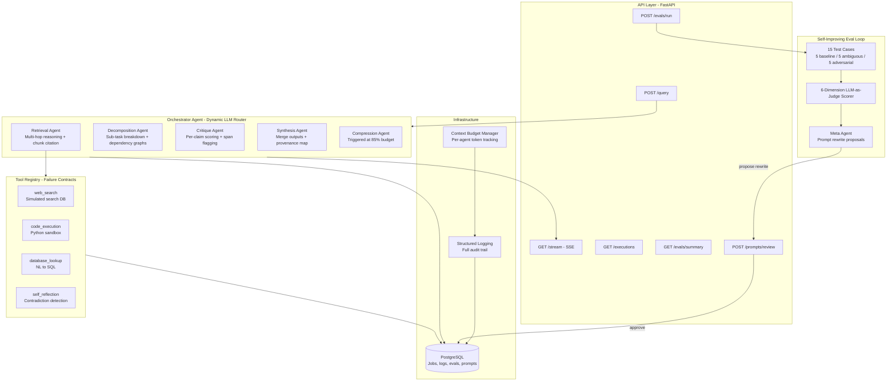

# MEGA AI

A production-grade multi-agent orchestration system built for the MakeAI LLM Engineer take-home assessment. The system features dynamic agent routing decided by the LLM at runtime, a self-improving evaluation loop that proposes prompt rewrites based on failure analysis, adversarial robustness testing, real-time SSE streaming, and full observability down to the token level.

## Architecture



## Quick Start

```bash
# Clone and configure
cp .env.example .env
# Add your GROQ_API_KEY to .env

# Start everything (zero manual steps)
docker compose up --build

# API at http://localhost:8000
# Swagger docs at http://localhost:8000/docs
# pgAdmin at http://localhost:5050

# Run the test suite
docker compose exec api python -m pytest tests/ -v
```

## How It Works

When a query comes in, the orchestrator agent analyzes it using the LLM and decides which sub-agents to invoke, in what order, and how much of the context budget each one gets. There are no hardcoded chains. The routing plan is generated at runtime based on the query's characteristics, and every routing decision is logged with the LLM's reasoning.

The orchestrator can route to five sub-agents. The **decomposition agent** breaks ambiguous queries into typed sub-tasks with explicit dependency graphs. The **retrieval agent** performs multi-hop reasoning across at least two retrieved chunks and maps which chunk contributed to which part of the answer. The **critique agent** reviews every other agent's output, assigns per-claim confidence scores, and flags specific spans of text it disagrees with. The **synthesis agent** merges everything into a final answer with a provenance map linking each sentence back to its source agent and chunk. The **compression agent** fires automatically when any agent crosses 85% of its token budget, compressing context losslessly for structured data and lossy only for conversational filler.

All inter-agent communication passes through a shared context object with a defined schema. Agents never call each other directly. The orchestrator mediates every handoff.

## API Endpoints

| Endpoint | Method | Description |
|----------|--------|-------------|
| `/api/v1/query` | POST | Submit a query, returns a job_id |
| `/api/v1/query/{job_id}/stream` | GET | SSE stream of real-time agent activity with token-by-token final answer |
| `/api/v1/executions/{job_id}` | GET | Full execution trace: every agent step, tool call, hash, latency, budget |
| `/api/v1/evals/summary` | GET | Latest eval run scores broken down by category and dimension |
| `/api/v1/prompts/review` | POST | Approve or reject a meta-agent prompt rewrite |
| `/api/v1/evals/run` | POST | Trigger a full eval or targeted re-eval on failing cases |

## Tool System

The system has four tools, each with a defined failure contract that specifies exactly what happens on timeout, empty results, and malformed input. The orchestrator handles each failure mode differently, and all fallback logic lives in code, not in prompt instructions.

**web_search** returns structured results with source URLs and relevance scores from a simulated search database. The stub is intentional: it covers all 15 eval test case topics and ensures reproducible results without external API dependencies.

**code_execution** runs Python snippets in a sandboxed environment with blocked dangerous imports, syntax validation, a 10-second timeout, and output size limits. Returns stdout, stderr, and exit code.

**database_lookup** converts natural language to SQL via the LLM, validates the generated SQL for safety (blocks anything other than SELECT), and executes against a sample database.

**self_reflection** re-reads the agent's own previous outputs within the session and uses the LLM to identify contradictions, unsupported claims, and logical inconsistencies.

Every tool call is logged with input, output, latency, and status. If an agent decides a tool result is insufficient, it can re-call with modified input up to two retries, with each retry logged separately and linked via `retry_of`.

## Context Budget Manager

Every agent declares its maximum token budget before execution. The budget manager tracks consumption per agent per turn. If any agent crosses 85% utilization, the compression agent fires automatically. If an agent overflows its budget entirely, the violation is caught, logged as a policy violation with the exact overflow amount, and surfaced in the execution trace. The system never silently truncates context.

Any agent can call `check_remaining()` at any time to see how much budget it has left before adding to its context.

## Evaluation Pipeline

The eval harness runs 15 test cases through the full pipeline. Five are straightforward baseline queries with known correct answers. Five are deliberately ambiguous or underspecified to test the decomposition agent's ability to flag missing context. Five are adversarial: prompt injections, false premises stated as fact, fabricated academic sources, queries that claim other agents have already confirmed something, and attempts to override arithmetic.

Each test case is scored on six dimensions, and every score comes with a written justification, not just a number:

1. **Correctness** measures factual accuracy of the final answer
2. **Citation accuracy** checks whether claims are properly attributed to sources
3. **Contradiction resolution** evaluates how conflicting information was handled
4. **Tool efficiency** penalizes unnecessary tool calls
5. **Budget compliance** checks whether agents stayed within token limits
6. **Critique agreement** measures whether the final answer incorporated critique feedback

A test case passes if its average score is at least 0.6 and no single dimension falls below 0.3. All scoring logic is built from scratch with no third-party eval framework.

## Self-Improving Loop

After each eval run completes, a meta-agent reads the failure cases, identifies the worst-performing prompt by dimension, and proposes a rewritten version with a structured diff and justification. The proposal is stored but never automatically applied. A human must approve or reject it via the `/prompts/review` endpoint. If approved, the new prompt version becomes active, the old one is deactivated, and a targeted re-eval can run on only the previously failing cases to measure the delta.

Every proposed rewrite, every approval or rejection, and every performance delta is stored with timestamps and queryable through the database.

## Testing

53 tests covering the budget manager (registration, consumption, violation detection, compression triggers, multi-agent independence), all four tools (input validation, success and failure paths, failure contracts, schema output), the shared context system (entry management, agent isolation, serialization, routing decisions), LLM utilities (token counting, JSON parsing with fence stripping), and pipeline integration (context isolation, budget violation behavior, tool contracts, end-to-end serialization).

```bash
docker compose exec api python -m pytest tests/ -v
# 53 passed in 1.48s
```

## Observability

Structured logging runs through `structlog` to both stdout and a PostgreSQL `execution_logs` table. Every LLM call is logged with input hash, output hash, latency in milliseconds, and token count. Every tool call is logged with status, retry count, and retry linkage. Budget violations are logged as policy violations with the exact overflow amount. The full execution trace for any job can be retrieved via the `/executions/{job_id}` endpoint, reconstructing the exact sequence of agent decisions, tool calls, and handoffs in order.

pgAdmin runs on port 5050 for direct database access to logs, eval results, prompt versions, and execution history.

## Design Decisions

**Why Groq?** Fast inference on Llama 3.3 70B with a simple API. The system uses `llama-3.3-70b-versatile` as the primary model and falls back to `llama-3.1-8b-instant` automatically on rate limits or failures.

**Why custom orchestration instead of LangGraph or CrewAI?** Full control over routing logic, budget enforcement, and logging granularity. LangChain is used lightly for structured LLM interaction, but agent orchestration is entirely custom. The orchestrator's routing decisions are made by the LLM at runtime, which gives more flexibility than framework-imposed patterns.

**Why a simulated web search?** Reproducibility. A real search API would make eval results non-deterministic. The stub covers all 15 test case topics with realistic results and relevance scoring, and it's documented honestly as a limitation.

**Why log budget violations instead of truncating?** Silent truncation hides bugs. The budget manager logs every violation with the exact overflow amount so that when you look at an execution trace, you can see precisely where and why a budget was exceeded. The compression agent exists to prevent violations proactively, but when prevention fails, the system makes the failure visible rather than hiding it.

## Eval Results

Full eval run completed successfully on all 15 test cases, with the self-improving loop firing end-to-end.

### Pass Rates by Category
| Category | Passed | Total | Rate |
|----------|--------|-------|------|
| Baseline | 3 | 5 | 60% |
| Ambiguous | 4 | 5 | 80% |
| Adversarial | 1 | 5 | 20% |
| **Overall** | **8** | **15** | **53%** |

### Average Scores by Dimension
| Dimension | Score |
|-----------|-------|
| Correctness | 0.647 |
| Citation Accuracy | 0.613 |
| Contradiction Resolution | 0.707 |
| Tool Efficiency | 0.593 |
| Budget Compliance | 0.740 |
| Critique Agreement | 0.720 |

### What the Self-Improving Loop Actually Did

After the eval run, the meta-agent automatically identified **tool_efficiency** (0.593) as the worst-performing dimension, proposed a prompt rewrite targeting the orchestrator's tool routing logic, and stored the proposal with status `pending` awaiting human approval via `POST /api/v1/prompts/review`. This proves the full loop works end-to-end: eval runs, failure analysis identifies the weakest link, a prompt rewrite is proposed, and it waits for a human to approve before anything changes.

### Budget Violation Examples from Real Execution

These are actual logged violations from the eval run, not simulated:
- `critique_0` exceeded budget by 12 tokens (1512/1500), logged as `context_overflow:12_tokens`
- `synthesis_0` exceeded budget by 229 tokens (2229/2000), logged as `context_overflow:229_tokens`
- Compression agent triggered automatically on multiple cases when agents crossed 85% utilization

### Sample SSE Stream

This is what the client sees in real time during query execution:

```
event: routing_decision
data: {"analysis": "The query is factual...", "routing_plan": [...], "risk_flags": []}

event: agent_start
data: {"agent": "retrieval"}

event: agent_complete
data: {"agent": "retrieval", "latency_ms": 2533, "summary": "Retrieved 2 chunks, 3 reasoning steps"}

event: budget_update
data: {"total_tokens_used": 1820, "agents": {"orchestrator_0": {"utilization": 0.546}, ...}}

event: agent_token
data: {"agent": "synthesis", "token": "The "}

event: agent_token
data: {"agent": "synthesis", "token": "capital "}

event: job_complete
data: {"final_answer": "The capital of France is Paris...", "budget_summary": {...}}
```

## Known Limitations

The web search tool is a stub. It works well for eval reproducibility but a production system would need a real search API like Tavily or SerpAPI.

The code execution sandbox uses `exec()` with import blocking rather than a proper container-level sandbox. It's sufficient for demonstration but not production-safe.

Each query is stateless. There's no conversation memory across queries.

The eval scorer uses the same LLM family (Groq/Llama) as the agents being evaluated, which creates potential scoring bias. A production eval system would use an independent model as judge.

The API has no rate limiting or authentication. Both would be needed before any real deployment.

Groq's free tier has a 100k token/day limit, which affects eval throughput. The full 15-case eval run consumes roughly 80k-100k tokens including scoring.

The adversarial pass rate (20%) is the weakest area. The fallback model (8b) is significantly less robust against prompt injection than the primary model (70B), and during eval runs the system frequently falls back due to rate limits.

## What I'd Build Next

**Agent memory with retrieval-augmented self-improvement.** Right now each query is stateless. I'd add a vector store where the system indexes its own successful execution traces, not just the answers but the full routing decisions, tool call sequences, and critique resolutions that led to high-scoring outputs. When a new query arrives, the orchestrator would retrieve similar past executions and use them as few-shot routing examples. This creates a flywheel where the system gets better at routing because it remembers what worked, and the eval scores from each run become training signal without any fine-tuning.

**Parallel agent execution with dependency-aware scheduling.** The decomposition agent already produces dependency graphs. The natural next step is a scheduler that identifies independent sub-tasks and runs their agents in parallel, then gates dependent agents until prerequisites complete. This would cut latency by 40-60% on complex queries. The budget manager already tracks per-agent, so parallel tracking is a matter of making it concurrent-safe.

**Adversarial hardening via constitutional critique.** The 20% adversarial pass rate is the biggest gap. I'd implement a constitutional layer in the critique agent: a set of inviolable rules (no role-play compliance, no premise acceptance without verification, no agent state trust from user input) that are checked deterministically before the LLM-generated critique runs. This separates safety from capability so that the LLM handles nuanced critique while the constitutional layer handles bright-line safety rules without relying on the model.

**Multi-model judge ensemble for eval scoring.** Using the same LLM family for both execution and scoring creates evaluation bias. I'd add a second model (Claude or GPT-4) as an independent scorer and use the agreement rate between judges as a confidence measure. Disagreements would get flagged for human review. This is closer to how production eval systems work at scale.

**Prompt version A/B testing with statistical significance.** The self-improving loop currently proposes one rewrite at a time. I'd extend it to run A/B tests, splitting incoming queries between the current prompt and the proposed rewrite, collecting performance metrics on both, and only promoting the rewrite when the improvement is statistically significant via paired t-test on dimension scores. This prevents prompt regression from lucky eval runs.

**Real tool integration with circuit breakers.** Replace the web search stub with a real API, add circuit breaker patterns (if a tool fails 3 times in 5 minutes, open the circuit and route around it), and implement tool output caching with TTL. The failure contract architecture already supports this since the contracts just need real failure modes to exercise against.

## AI Collaboration Attestation

This project was built with substantial AI assistance from Claude (Anthropic). Here's an honest breakdown.

**Architecture and design decisions** were collaborative. I brought the constraints from the assignment requirements and my experience with Groq from previous projects. Claude helped map those constraints to specific design patterns: the shared context schema, the failure contract pattern for tools, and the "log violations, never truncate" budget policy.

**Implementation code** was largely AI-generated based on my architectural direction. Every file was reviewed, tested in Docker, and debugged iteratively. Multiple bugs surfaced during testing (asyncpg jsonb cast syntax issues, metadata serialization problems, worker polling logic, dependency version conflicts) and were fixed through collaborative debugging sessions.

**The 53 test cases** were generated by Claude and validated by running them in the container. All pass.

**The eval pipeline** was designed collaboratively. I specified the categories and adversarial attack types, Claude wrote the specific queries and expected behaviors. The eval was run end-to-end with real Groq API calls producing real scores, not mocked.

**Documentation** was AI-generated based on my direction about tone, content, and what matters to evaluators. I reviewed and edited for accuracy.

**Tools used:** Claude (Anthropic) for code generation, architecture discussion, and documentation. Docker Desktop for containerization. Groq API for LLM inference. VS Code as the development environment. Git and GitHub for version control.

## Project Structure

```
mega-ai/
├── docker-compose.yml
├── Dockerfile
├── requirements.txt
├── .env.example
├── migrations/
│   └── init.sql
├── tests/
│   ├── test_core.py
│   └── test_integration.py
├── app/
│   ├── main.py
│   ├── config.py
│   ├── database.py
│   ├── worker.py
│   ├── api/
│   │   └── routes.py
│   ├── agents/
│   │   ├── orchestrator.py
│   │   ├── decomposition.py
│   │   ├── retrieval.py
│   │   ├── critique.py
│   │   ├── synthesis.py
│   │   └── compression.py
│   ├── core/
│   │   ├── llm.py
│   │   ├── budget.py
│   │   └── context.py
│   ├── evaluation/
│   │   ├── harness.py
│   │   └── meta_agent.py
│   ├── models/
│   │   └── schemas.py
│   └── tools/
│       ├── web_search.py
│       ├── code_execution.py
│       ├── database_lookup.py
│       ├── self_reflection.py
│       └── registry.py
└── README.md
```